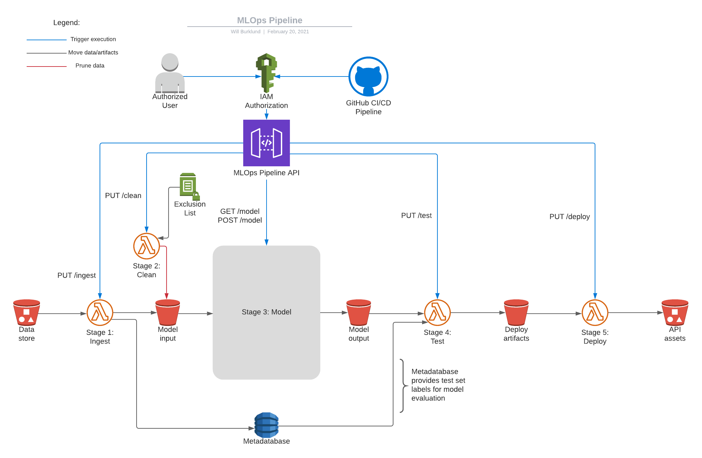

 

  

  <h3 align="center"><a href="https://www.wgu.edu/">WGU</a> Capstone Project</h3>

  

    Pneumonia detection system. Scans chest X-ray images for pneumonia using an Inception-v4 network and MLOps pipeline. <i>For demonstration purposes only.</i>
  

  
<h2 style="display: inline-block">Table of Contents</h2>

  <ol>
    <li>
      <a href="#about-the-project">About The Project</a>
      <ul>
        <li><a href="#built-with">Built With</a></li>
      </ul>
    </li>
    <li>
      <a href="#installation-and-usage">Installation And Usage</a>
    </li>
    <li><a href="#license">License</a></li>
    <li><a href="#contact">Contact</a></li>
    <li><a href="#acknowledgements">Acknowledgements</a></li>
  </ol>

## About The Project

For my Bachelor of Science in Computer Science capstone project, I decided to apply the Inception-v4 network to scan chest X-ray images for pneumonia. I used this project as a trial run for creating a production-grade machine learning system. As such, the project includes a 5-stage MLOps pipeline implemented in AWS as well as a simple web application.

Here's what sets this project apart:
* Implementation of Inception-v4 network created from the original paper
* GPU training in AWS with costs controlled by automatically starting and stopping instances
* Written in 8 general-purpose programming languages, including Python, F#, Java, and C++
* Sensitive data is encrypted in transit and at rest, in accordance with common industry regulations
* Cloud infrastructure managed by Terraform

### Built With

* [TensorFlow](https://www.tensorflow.org/)
* [React](https://reactjs.org/)
* [Docker](https://www.docker.com/)
* [Terraform](https://www.terraform.io/)
* [GitHub Actions](https://github.com/features/actions)
* And much more!

## Installation And Usage

This project's infrastructure takes some work to set up. If you're up for a challenge, here are the major steps.

### Prerequisites

* GitHub account
* AWS account with access to G4 instances
* AWS CLI configured with administrative credentials
* Docker
* Terraform

### Installation

1. Set up a Terraform S3 state bucket and DynamoDB lock table, changing the appropriate values in `backend.tf`
2. `terraform init`
3. Create S3 buckets, AWS Certificate Manager TLS certificate, DynamoDB table, and Route 53 hosted zone referenced as Terraform data resources, changing values as appropriate
4. Create ECR image repository for ECS task definition and upload API image with included Dockerfile
5. Download [CoronaHack](https://www.kaggle.com/praveengovi/coronahack-chest-xraydataset) dataset, run metadata augmentation, and upload all to data store bucket
6. Configure GitHub Actions with secret variables
7. Run GitHub Actions pipeline to:
   1.  Build project code and upload artifacts to code store bucket
   2.  `terraform apply`
   3.  Run MLOps pipeline

### Usage

1. Open web frontend URL
2. Enter selected access key
3. Use buttons on the header to access image scanning and statistical reporting functionality

## License

Distributed under the AGPL-3.0 License. See `LICENSE` for more information.

## Contact

Will Burklund - wburklund.com - waburklund@gmail.com

Project Link: [https://github.com/wburklund/wgu-capstone](https://github.com/wburklund/wgu-capstone)

## Acknowledgements

* [Inception-v4 paper](https://arxiv.org/abs/1602.07261)
* [MLOps article](https://cloud.google.com/solutions/machine-learning/mlops-continuous-delivery-and-automation-pipelines-in-machine-learning)
* [Terraform Lambda `source_code_hash` solution](https://stackoverflow.com/a/64713147)
* [Keras example](https://gist.github.com/joelouismarino/a2ede9ab3928f999575423b9887abd14)
* [Best-README-Template](https://github.com/othneildrew/Best-README-Template)
